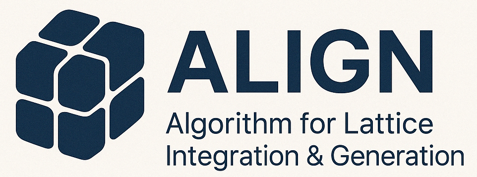

# Algorithm for Lattice Integration & GeNeration (ALIGN)

Find common supercells of given two lattices where ab planes of two lattices are similar (e.g. square-square, hexagonal-hexagonal)

## Features
* Common supercell generation for different rotational angles
* Common supercell generation for a given rotational angle
* Ouput format: CIF
  
## Requirements
* Python
* Pymatgen
* Numpy
* Sympy
* Matplotlib

## Usage
1. Create a pre-calculated table to find common supercells with a maximum index and the constant D determined by the symmetry (e.g. square: D = -1, hexagonal: D = -3)
```
python Zquad_maketable.py --max_index {number} D
```
2. Find common supercells of two lattice cif files from the pre-calculated table
```
python find_common_supercell_main.py --tol_strain {float} --output_type {cif|latex} --target_angles_file {none|filename} --max_index {number} --tol_angle {float} Top_cif_filename Bottom_cif_filename 
```
If you want to find the common supercells with certain rotation angles, you can designate the target_angle_file path. This text file contains the target rotation angles line by line. If you don't need to restrict rotation angles, you can omit this parameter.

3. If the output_type is cif, the `heterostructure_temp` directory will be generated and the heterostructure cif files will be exported in this directory. `{top_cif_basename}_{m11}_{m12}W_{bottom_cif_basename}_{n11}_{n12}W_reduced.cif` is the final result of the finding common supercell, and the others are used for intermediate steps (I will improve the readibility of file names and directory structure). m11, m12, n11, and n12 < max_index are the transformation matrix elements for top and bottom layers.
```
heterostructure_temp
├{top_cif_basename}_{m11}_{m12}W.cif
├{top_cif_basename}_{m11}_{m12}W_novacuum.cif
├{top_cif_basename}_{m11}_{m12}W_{bottom_cif_basename}_{n11}_{n12}W.cif
├{top_cif_basename}_{m11}_{m12}W_{bottom_cif_basename}_{n11}_{n12}W_reduced.cif
├{bottom_cif_basename}_{n11}_{n12}W.cif
├{bottom_cif_basename}_{n11}_{n12}W_novacuum.cif
└…
```

## Citation
If you use this code, please cite our paper:
```
@article{https://doi.org/10.1002/smtd.202400579,
author = {Lee, Weon-Gyu and Lee, Jung-Hoon},
title = {A Deterministic Method to Construct a Common Supercell Between Two Similar Crystalline Surfaces},
journal = {Small Methods},
volume = {8},
number = {12},
pages = {2400579},
doi = {https://doi.org/10.1002/smtd.202400579},
year = {2024}
}
```
